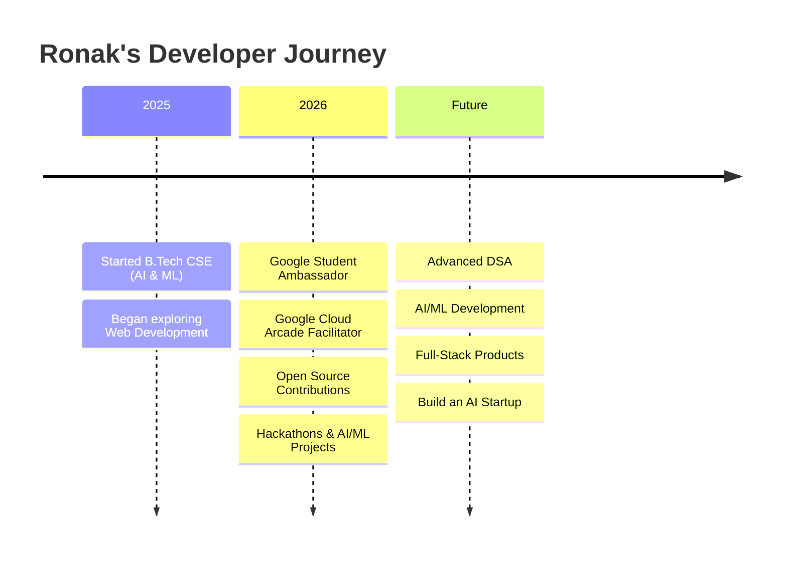

<div align="center">

# 👋 Hey, I'm **Ronak Sharma** 🚀

### `CSE (AI & ML) @ UIET MDU Rohtak`

💻 Full-Stack Developer  •  🤖 AI/ML Explorer  •  🌐 Open-Source Contributor
☁️ Google Cloud Arcade Facilitator  •  🎓 Google Student Ambassador 2026

**Building. Learning. Experimenting. Growing. 🚀**

<br>

<a href="https://github.com/ronaksharma2908">
  
</a>
<a href="https://github.com/ronaksharma2908?tab=repositories">
  
</a>
<a href="https://www.linkedin.com/in/ronak29sharma/">
  
</a>

</div>

---

## 🧑‍💻 About Me

I'm a **B.Tech CSE (AI & ML) student** passionate about building useful products, solving problems, and exploring emerging technologies.

* 🎓 CSE (AI & ML) — **UIET MDU Rohtak**
* 💻 Focused on **Full-Stack Development**
* 🤖 Exploring **AI/ML & Data Science**
* 🧠 Building a strong foundation in **DSA & Competitive Programming**
* 🌐 Contributing to **Open Source**
* ☁️ **Google Cloud Arcade Facilitator**
* 🎓 **Google Student Ambassador 2026**
* 🚀 Working toward building my own **AI-powered startup**

> 💡 *"Learn → Build → Share → Repeat."*

---

## 🏆 Highlights

<table>
<tr>
<td align="center" width="25%">

### ☁️

**Google Cloud**

Google Cloud Arcade
**Facilitator**

</td>

<td align="center" width="25%">

### 🎓

**Google**

Student Ambassador
**2026**

</td>

<td align="center" width="25%">

### 🏅

**Open Source**

NSOC'26 • GSSoC
ECSOC'26

</td>

<td align="center" width="25%">

### 🏆

**Hackathons**

Finalist
AI/ML Projects

</td>
</tr>
</table>

---

## 🥇 Achievements & Experience

* 🏆 **Hackathon Finalist** — Antibiotic Resistance Prediction Project
* 🎓 **Google Student Ambassador 2026**

  * 🏆 2100+ leaderboard points
  * 🥇 Golden Badge unlocked
* ☁️ **Google Cloud Arcade Facilitator**

  * 🎮 Facilitating Google Cloud learning activities
  * 🚀 Helping learners explore Google Cloud through hands-on labs
* 🌐 **Open-Source Contributor**

  * NSOC'26
  * GSSoC
  * ECSOC'26
* 🎓 **Elite Her Hackathon Participant**
* 🧩 Active problem solver on **LeetCode & GeeksforGeeks**

---

# 🛠️ Tech Stack

### 👨‍💻 Languages

<p>

</p>

### 🎨 Frontend

<p>

</p>

### ⚙️ Backend & Databases

<p>

</p>

### 🤖 AI / ML & Data

<p>

</p>

`NumPy` • `Pandas` • `Scikit-Learn` • `Streamlit`

### 🔧 Tools & Platforms

<p>

</p>

### 🎨 UI / UX

`Figma` • `Responsive Design` • `Modern UI` • `CSS`

---

# 📚 Currently Learning

```text
DSA & Competitive Programming   █████████░  90%
Full-Stack Development          ████████░░  80%
AI / Machine Learning            ██████░░░░  60%
Cloud & DevOps                   █████░░░░░  50%
Open Source                      ███████░░░  70%
```

### 🧠 My Current Focus

* 🧩 DSA & problem solving
* 💻 Advanced Full-Stack Development
* 🤖 AI/ML fundamentals
* ☁️ Google Cloud
* 🌐 Open Source contribution
* 🚀 Building real-world projects

---

# 🚀 Featured Projects

<table>
<tr>

<td width="50%">

## 📝 TO-DO-APP

A simple and clean task management application focused on usability and responsive UI.

**Tech:** HTML • CSS • JavaScript

🔗 [View Repository](https://github.com/ronaksharma2908/TO-DO-APP)

</td>

<td width="50%">

## 🧬 arpmodel

Machine Learning project focused on **Antibiotic Resistance Prediction**.

**Tech:** Python • ML • Data Science

🔗 [View Repository](https://github.com/ronaksharma2908/arpmodel)

</td>

</tr>

<tr>

<td width="50%">

## 📊 AI-SaaS-Dashboard

Interactive analytics dashboard powered by Streamlit.

**Tech:** Python • Streamlit • Data Analytics

🔗 [View Repository](https://github.com/ronaksharma2908/AI-SaaS-Dashboard)

</td>

<td width="50%">

## 🌐 My Portfolio

Personal developer portfolio showcasing my projects, skills and journey.

**Tech:** HTML • CSS • JavaScript

🔗 [View Repository](https://github.com/ronaksharma2908/myportfolio)

</td>

</tr>

<tr>

<td width="50%">

## 💳 SAAS-BILLING Portal

Full-stack SaaS billing application built using the MERN stack.

**Tech:** MongoDB • Express • React • Node.js

</td>

<td width="50%">

## 🧮 Scientific Calculator

A scientific calculator built using Python.

**Tech:** Python

</td>

</tr>
</table>

---

# 📊 GitHub Analytics

<div align="center">


</div>

<br>

<div align="center">


</div>

---

# 📈 Contribution Graph

<div align="center">


</div>

---

# 🐍 Contribution Snake

<div align="center">


</div>

---

# 🌱 My Journey



---

# 🎯 2026 Goals

| Goal                         | Status         |
| ---------------------------- | -------------- |
| 🧠 Master DSA                | 🔄 In Progress |
| 💻 Build Full-Stack Projects | 🔄 In Progress |
| 🤖 Learn AI/ML               | 🔄 In Progress |
| 🌐 Contribute to Open Source | 🔥 Active      |
| ☁️ Explore Google Cloud      | 🔥 Active      |
| 🚀 Build AI Products         | 🎯 Next        |

---

# 🤝 Let's Connect

<div align="center">

<a href="https://www.linkedin.com/in/ronak29sharma/">

</a>

<a href="https://github.com/ronaksharma2908">

</a>

<a href="https://leetcode.com/ronak2908sharma">

</a>


</div>

<br>

<div align="center">

### 💡 Have an idea? Let's build it.

**Open to collaborations • Open Source • Hackathons • AI Projects**

<br>

⭐ **If you find my work interesting, consider starring my repositories!**

<br>


</div>

---

<div align="center">

### 🚀 *Building today. Innovating tomorrow.*

</div>
