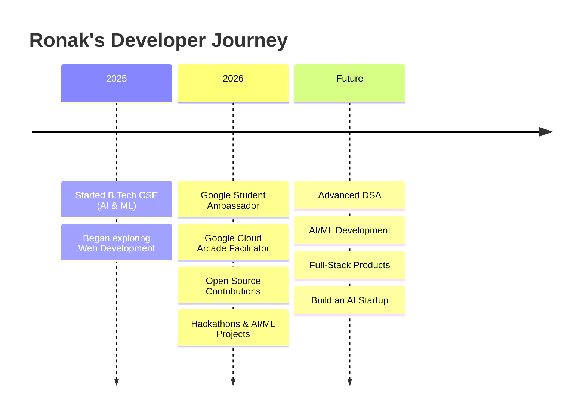

<div align="center">

<!-- Animated Banner -->


<!-- Typing Animation -->
<a href="https://git.io/typing-svg">
  
</a>

<br/><br/>

<!-- Social Badges -->
<a href="https://github.com/ronaksharma2908">
  
</a>
<a href="https://github.com/ronaksharma2908?tab=repositories">
  
</a>
<a href="https://www.linkedin.com/in/ronak29sharma/">
  
</a>
<a href="mailto:sharmaronak2908@gmail.com">
  
</a>


</div>

---


## 🧑‍💻 About Me

I'm a **B.Tech CSE (AI & ML) student** passionate about building useful products, solving real problems, and exploring emerging technologies.

- 🎓 **CSE (AI & ML)** — UIET MDU Rohtak
- 💻 Focused on **Full-Stack Development**
- 🤖 Exploring **AI/ML & Data Science**
- 🧠 Building foundation in **DSA & Competitive Programming**
- 🌐 Contributing to **Open Source**
- ☁️ **Google Cloud Arcade Facilitator**
- 🎓 **Google Student Ambassador 2026**
- 🚀 Working toward an **AI-powered startup**

<br/>

> 💡 *"Learn → Build → Share → Repeat."*

<br clear="both"/>

---

## 🏆 Highlights

<div align="center">

<table>
<tr>
<td align="center" width="25%">

<br/><br/>
☁️ <b>Google Cloud</b><br/>Arcade <b>Facilitator</b>
</td>
<td align="center" width="25%">

<br/><br/>
🎓 <b>Google</b><br/>Student Ambassador<br/><b>2026 — Cohort I</b>
</td>
<td align="center" width="25%">

<br/><br/>
🏅 <b>Open Source</b><br/>NSOC'26 • GSSoC<br/>ECSOC'26 • OSCI'26
</td>
<td align="center" width="25%">

<br/><br/>
🏆 <b>Hackathons</b><br/>Actively<br/>Participating
</td>
</tr>
</table>

</div>

---

## 🥇 Achievements & Experience

<div align="center">

| 🏅 Achievement | 📋 Details |
|:---|:---|
| 🎓 **Google Student Ambassador 2026** | 🏆 3200+ leaderboard points &nbsp;•&nbsp; 🥇 Platinum Badge Unlocked |
| ☁️ **Google Cloud Arcade Facilitator** | 🎮 Facilitating Cloud learning &nbsp;•&nbsp; 🚀 Hands-on lab guidance |
| 🌐 **Open-Source Contributor** | NSOC'26 &nbsp;•&nbsp; GSSoC &nbsp;•&nbsp; ECSOC'26 &nbsp;•&nbsp; OSCI'26 |
| 🧩 **Problem Solving** | Active on **LeetCode** & **GeeksforGeeks** |

</div>

---

## 🛠️ Tech Stack

<div align="center">

### 👨‍💻 Languages


### 🎨 Frontend


### ⚙️ Backend & Databases


### 🤖 AI / ML & Data Science


<br/>


### 🔧 Tools & Platforms


### 🎨 UI / UX


</div>

---

## 📚 Currently Learning

<div align="center">

```text
🧩 DSA & Competitive Programming  ████████████████████░  90%
💻 Full-Stack Development         ████████████████░░░░░  80%
🌐 Open Source                    ██████████████░░░░░░░  70%
🤖 AI / Machine Learning          ████████████░░░░░░░░░  60%
☁️  Cloud & DevOps                ██████████░░░░░░░░░░░  50%
```

</div>

---

## 🚀 Featured Projects

<div align="center">

<table>
<tr>
<td width="50%" valign="top">

### 📝 TO-DO-APP


A clean task management app focused on usability and responsive UI.

[](https://github.com/ronaksharma2908/TO-DO-APP)

</td>
<td width="50%" valign="top">

### 🧬 arpmodel


ML project for **Antibiotic Resistance Prediction** using data science techniques.

[](https://github.com/ronaksharma2908/arpmodel)

</td>
</tr>

<tr>
<td width="50%" valign="top">

### 📊 AI-SaaS-Dashboard


Interactive analytics dashboard with real-time insights powered by Streamlit.

[](https://github.com/ronaksharma2908/AI-SaaS-Dashboard)

</td>
<td width="50%" valign="top">

### 🌐 My Portfolio


Personal developer portfolio showcasing projects, skills, and journey.

[](https://github.com/ronaksharma2908/myportfolio)

</td>
</tr>

<tr>
<td width="50%" valign="top">

### 💳 SAAS-BILLING Portal


Full-stack SaaS billing application built on the **MERN** stack.

</td>
<td width="50%" valign="top">

### 🧮 Scientific Calculator


A feature-rich scientific calculator application built using Python.

</td>
</tr>
</table>

</div>

---

## 📊 GitHub Analytics

<div align="center">


&nbsp;&nbsp;


</div>

<br/>

<div align="center">


</div>

---

## 🏆 GitHub Trophies

<div align="center">


</div>

---

## 📈 Contribution Graph

<div align="center">


</div>

---

## 🐍 Contribution Snake

<div align="center">

<picture>
  <source media="(prefers-color-scheme: dark)" srcset="https://raw.githubusercontent.com/ronaksharma2908/ronaksharma2908/output/github-contribution-grid-snake-dark.svg"/>
  <source media="(prefers-color-scheme: light)" srcset="https://raw.githubusercontent.com/ronaksharma2908/ronaksharma2908/output/github-contribution-grid-snake.svg"/>
  
</picture>

</div>

---

## 🌱 My Journey


```mermaid
timeline
    title Ronak's Developer Journey

    2025 : Started B.Tech CSE (AI & ML)
         : Began exploring Web Development

    2026 : Google Student Ambassador
         : Google Cloud Arcade Facilitator
         : Open Source Contributions
         : Hackathons & AI/ML Projects

    Future : Advanced DSA
           : AI/ML Development
           : Full-Stack Products
           : Build an AI Startup
```

---

## 🎯 2026 Goals

<div align="center">

| Goal | Status | Progress |
|:---|:---:|:---|
| 🧠 Master DSA | 🔄 In Progress | `████████░░` 80% |
| 💻 Build Full-Stack Projects | 🔄 In Progress | `███████░░░` 70% |
| 🤖 Learn AI/ML | 🔄 In Progress | `██████░░░░` 60% |
| 🌐 Contribute to Open Source | 🔥 Active | `████████░░` 80% |
| ☁️ Explore Google Cloud | 🔥 Active | `███████░░░` 70% |
| 🚀 Build AI Products | 🎯 Next | `████░░░░░░` 40% |

</div>

---

## 💬 Random Dev Quote

<div align="center">


</div>

---

## 🤝 Let's Connect

<div align="center">

<a href="https://www.linkedin.com/in/ronak29sharma/">
  
</a>
&nbsp;
<a href="https://github.com/ronaksharma2908">
  
</a>
&nbsp;
<a href="mailto:sharmaronak2908@gmail.com">
  
</a>

<br/><br/>

### 💡 Have an idea? Let's build it together.

**Open to Collaborations &nbsp;•&nbsp; Open Source &nbsp;•&nbsp; Hackathons &nbsp;•&nbsp; AI Projects**

<br/>

⭐ **If you find my work interesting, consider starring my repositories!**

</div>

---

<!-- Footer Wave -->

