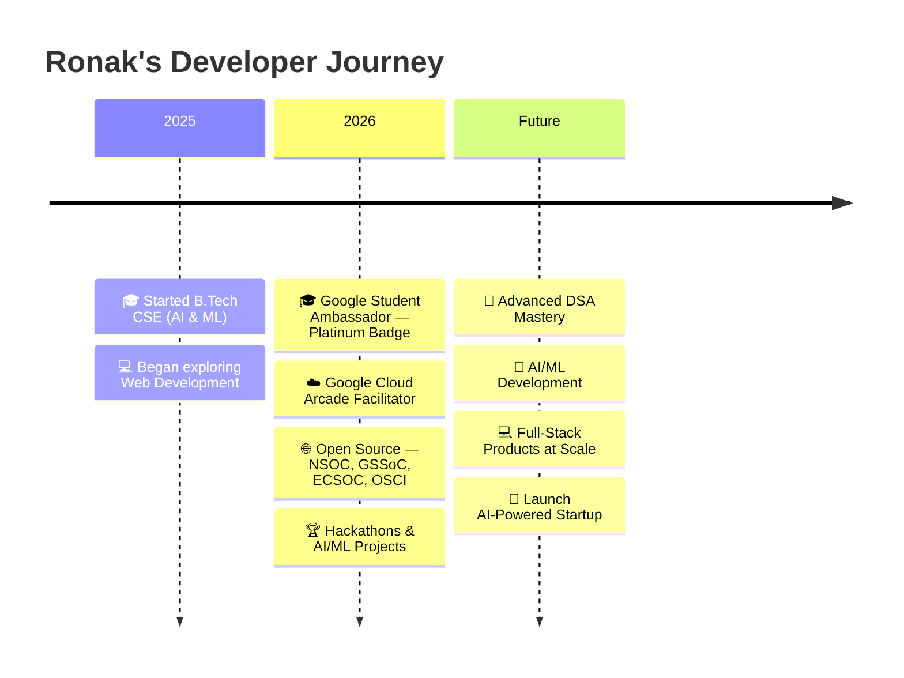

<!-- HEADER: Slice-type diagonal cyberpunk banner -->


<div align="center">

<!-- Terminal-style typing animation -->


<br/><br/>

<!-- Badges -->
<a href="https://github.com/ronaksharma2908">
  
</a>
<a href="https://github.com/ronaksharma2908?tab=repositories">
  
</a>
<a href="https://www.linkedin.com/in/ronak29sharma/">
  
</a>
<a href="mailto:sharmaronak2908@gmail.com">
  
</a>


</div>

---

## 🖥️ `$ neofetch --user ronaksharma2908`

```
  ██████╗  ██████╗ ███╗   ██╗ █████╗ ██╗  ██╗         ronak@github
  ██╔══██╗██╔═══██╗████╗  ██║██╔══██╗██║ ██╔╝          ──────────────────────────────────────
  ██████╔╝██║   ██║██╔██╗ ██║███████║█████╔╝            OS           :  Developer Edition v2026
  ██╔══██╗██║   ██║██║╚██╗██║██╔══██║██╔═██╗            Role         :  Full-Stack Dev + AI/ML Explorer
  ██║  ██║╚██████╔╝██║ ╚████║██║  ██║██║  ██╗           University   :  UIET MDU Rohtak (CSE AI & ML)
  ╚═╝  ╚═╝ ╚═════╝ ╚═╝  ╚═══╝╚═╝  ╚═╝╚═╝  ╚═╝          Location     :  India 🇮🇳
                                                          Shell        :  VSCode + Bash + Terminal
      ronak@github:~$ _                                   Uptime       :  Since 2025
                                                          Languages    :  Python, JS, C, C++
                                                          Status       :  Currently Building 🚀
                                                          Coffee/Day   :  ∞ cups
                                                          ──────────────────────────────────────
                                                          ☁️  Google Cloud    Arcade Facilitator
                                                          🎓 Google           Student Ambassador 2026
                                                          🌐 Open Source      NSOC'26 | GSSoC | ECSOC'26
                                                          🏆 Hackathons       Actively Competing
                                                          ──────────────────────────────────────
                                                          ██ ██ ██ ██ ██ ██ ██ ██ ██ ██ ██ ██ ██
```

---

## 📦 `$ pip list --ronak-stack`

```
ronak@github:~$ pip list --installed

Package                  Version       Category         Status
───────────────────────  ────────────  ───────────────  ────────────
python                   3.x           Language         ✅  Active
javascript               ES2024        Language         ✅  Active
c / c++                  17 / 20       Language         ✅  Active
html5 + css3             Latest        Frontend         ✅  Active
react                    18.x          Frontend         ✅  Active
nodejs                   20.x          Backend          ✅  Active
express                  4.x           Backend          ✅  Active
mongodb                  7.x           Database         ✅  Active
mysql                    8.x           Database         ✅  Active
numpy                    1.x           AI/ML            ✅  Active
pandas                   2.x           AI/ML            ✅  Active
scikit-learn             1.x           AI/ML            ✅  Active
streamlit                1.x           AI/ML            ✅  Active
git + github             2.x           DevTools         ✅  Active
vscode                   Latest        DevTools         ✅  Active
figma                    Latest        UI/UX            ✅  Active
───────────────────────  ────────────  ───────────────  ────────────
16 packages installed, 0 conflicts, 0 errors ✓
```

<div align="center">

</div>

---

## 🗂️ `$ git log --oneline --graph --all`

```
ronak@github:~$ git log --oneline --graph --decorate --all

* a7f3c2e (HEAD -> main)  🧬  arpmodel              — Antibiotic Resistance Prediction (Python · ML · Data Science)
* b2e9d1f (origin/main)   📊  AI-SaaS-Dashboard     — Interactive analytics dashboard  (Python · Streamlit)
* c4a8f0e                 📝  TO-DO-APP             — Clean task management app        (HTML · CSS · JavaScript)
* d1b7e3a                 🌐  myportfolio           — Personal developer portfolio     (HTML · CSS · JavaScript)
* e9c2d4f (dev)           💳  SAAS-BILLING-Portal   — Full-stack billing system        (MongoDB · Express · React · Node.js)
* f6a1b8c                 🧮  Scientific-Calculator  — Feature-rich calculator          (Python)
|
◉  More commits incoming... stay tuned 🚀
```

<div align="center">

| Project | Stack | Repo |
|:---|:---|:---:|
| 🧬 **arpmodel** | `Python` `Scikit-Learn` `Pandas` | [](https://github.com/ronaksharma2908/arpmodel) |
| 📊 **AI-SaaS-Dashboard** | `Python` `Streamlit` | [](https://github.com/ronaksharma2908/AI-SaaS-Dashboard) |
| 📝 **TO-DO-APP** | `HTML` `CSS` `JavaScript` | [](https://github.com/ronaksharma2908/TO-DO-APP) |
| 🌐 **myportfolio** | `HTML` `CSS` `JavaScript` | [](https://github.com/ronaksharma2908/myportfolio) |
| 💳 **SAAS-BILLING-Portal** | `MongoDB` `Express` `React` `Node.js` | `Coming Soon` |
| 🧮 **Scientific-Calculator** | `Python` | `Coming Soon` |

</div>

---

## ⚡ `$ ps aux \| grep ronak`

```
ronak@github:~$ ps aux | grep ronak

  PID    PROCESS                    CPU%    MEM     STATE        PRIORITY
  ───    ─────────────────────────  ──────  ──────  ───────────  ────────
  001    dsa_competitive_prog       90%     HIGH    🟢 Running   CRITICAL
  002    fullstack_development      80%     HIGH    🟢 Running   HIGH
  003    open_source_contrib        70%     MED     🟢 Running   HIGH
  004    ai_ml_learning             60%     MED     🟡 Building  NORMAL
  005    google_cloud_devops        50%     MED     🟡 Building  NORMAL
  006    ai_startup_dream           --      --      🔵 Queued    FUTURE
  ───    ─────────────────────────  ──────  ──────  ───────────  ────────
  6 processes total  |  3 running  |  2 building  |  1 queued

ronak@github:~$ _
```

---

## 📊 `$ neofetch --github-stats`

<div align="center">


&nbsp;


</div>

<div align="center">


</div>

---

## 🏆 `$ cat trophies.json`

<div align="center">


</div>

---

## 📈 `$ watch -n 1 contribution_graph.sh`

<div align="center">


</div>

---

## 🐍 `$ python watch_commits.py --animate`

<div align="center">

<picture>
  <source media="(prefers-color-scheme: dark)" srcset="https://raw.githubusercontent.com/ronaksharma2908/ronaksharma2908/output/github-contribution-grid-snake-dark.svg"/>
  <source media="(prefers-color-scheme: light)" srcset="https://raw.githubusercontent.com/ronaksharma2908/ronaksharma2908/output/github-contribution-grid-snake.svg"/>
  
</picture>

</div>

---

## 📋 `$ tail -f achievements.log`

```
ronak@github:~$ tail -f /var/log/achievements.log

[2026-01] [✅ SUCCESS]  Google Student Ambassador 2026 — Cohort I
                        ↳ 🥇 Platinum Badge Unlocked
                        ↳ 🏆 3200+ Leaderboard Points Earned

[2026-01] [✅ SUCCESS]  Google Cloud Arcade Facilitator
                        ↳ ☁️  Facilitating Google Cloud Learning Activities
                        ↳ 🚀 Guiding Learners Through Hands-On Labs

[2026-xx] [🟢 ACTIVE]  Open Source Contributor
                        ↳ NSOC'26 | GSSoC | ECSOC'26 | OSCI'26

[ONGOING] [🟢 ACTIVE]  Competitive Problem Solving
                        ↳ 🧩 LeetCode — Active
                        ↳ 🧩 GeeksforGeeks — Active

[FUTURE]  [🔵 PENDING] AI-Powered Startup
                        ↳ 🚀 In Planning Phase...

ronak@github:~$ _    # More logs incoming...
```

---

## 🗺️ `$ cat journey.md`


```mermaid
timeline
    title Ronak's Developer Journey

    2025 : 🎓 Started B.Tech CSE (AI & ML)
         : 💻 Began exploring Web Development

    2026 : 🎓 Google Student Ambassador — Platinum Badge
         : ☁️  Google Cloud Arcade Facilitator
         : 🌐 Open Source — NSOC, GSSoC, ECSOC, OSCI
         : 🏆 Hackathons & AI/ML Projects

    Future : 🧩 Advanced DSA Mastery
           : 🤖 AI/ML Development
           : 💻 Full-Stack Products at Scale
           : 🚀 Launch AI-Powered Startup
```

---

## 💬 `$ fortune | cowsay`

<div align="center">


</div>

---

## 📡 `$ ping ronak --connect`

<div align="center">

```
ronak@github:~$ ping ronak --connect --say-hello

Pinging ronak.sharma across the internet...

  REPLY from linkedin  : bytes=∞  time<1ms  TTL=♾   → linkedin.com/in/ronak29sharma
  REPLY from github    : bytes=∞  time<1ms  TTL=♾   → github.com/ronaksharma2908
  REPLY from gmail     : bytes=∞  time<1ms  TTL=♾   → sharmaronak2908@gmail.com

Ping statistics for ronak.sharma:
  Packets: Sent = ∞, Received = ∞, Lost = 0 (0% loss) ✓
  Open to: Collaborations • Open Source • Hackathons • AI Projects
```

</div>

<div align="center">

<a href="https://www.linkedin.com/in/ronak29sharma/">
  
</a>
&nbsp;
<a href="https://github.com/ronaksharma2908">
  
</a>
&nbsp;
<a href="mailto:sharmaronak2908@gmail.com">
  
</a>

<br/><br/>

> ⭐ **If you find my work useful, consider starring my repositories!**

</div>

---

<!-- FOOTER -->

